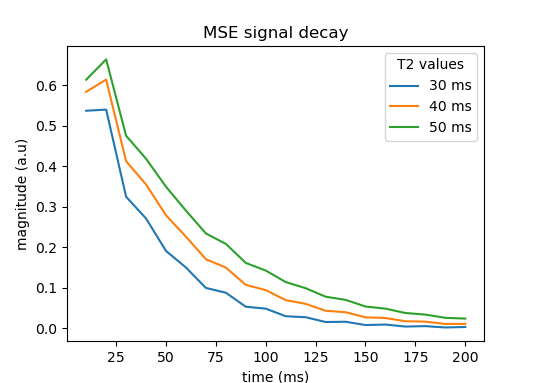

# epgpy

## Description

A python library for simulating NMR signals using the Extended Phase Graph (EPG) formalism.

Its aims are:

- Simplicity (few dependencies, user-friendly, _pythonic_ syntax)
- Generality (can be used for simulations, optimization, etc.)
- Efficiency* (vectorization, GPU enabled)

*only some degree of efficiency can be expected from this implementation, if speed is really critical, other implementations may be more suitable.

A number of extensions are, or will be, implemented:

- Arbitrary 3D gradients
- Anisotropic diffusion
- Multi-compartment exchanges, including magnetization transfer
- Differentiability (e.g., for sequence optimization)
- (soon) GPU compatible (via `cupy`)
- (soon) General operator merging for faster simulations

Please look into the `docs` and `examples` folders for usage examples.

Disclaimer : this is a research project, and the authors give no guaranty on the validity of the generated results. 

## Example usage

Simulate a multi-spin-echo NMR sequence using EPG operators:

```python
from epgpy import epg

FA = 120 # flip angle (degrees)
ESP = 10 # echo spacing (ms)
Nrf = 20 # num. rf

# relaxation times (multiple T2 values are simulated at once)
T1 = 150 # ms
T2 = [30, 40, 50] # ms

# operators
exc = epg.T(90, 90) # excitation
rfc = epg.T(FA, 0) # refocussing
rlx = epg.E(ESP/2, T1, T2) # relaxation
shift = epg.S(1, duration=ESP / 2) # spoiler gradients
adc = epg.ADC # reading flag

# concatenate operators (in nested lists)
seq = [exc] + [[shift, rlx, rfc, shift, rlx, adc]] * Nrf

# simulate the signal
signal = epg.simulate(seq)
# get adc times
times = epg.get_adc_times(seq)

#
# plot signal
from matplotlib import pyplot as plt
plt.plot(times, plt.np.abs(signal))
plt.title('MSE signal decay')
plt.xlabel('time (ms)')
plt.ylabel('magnitude (a.u)')
plt.legend(labels=[f'{t2} ms' for t2 in T2], title='T2 values')
plt.show()

```


## References

These references were used for the implementation:

- Gao, Xiang, Valerij G. Kiselev, Thomas Lange, Jürgen Hennig, et Maxim Zaitsev. « Three‐dimensional Spatially Resolved Phase Graph Framework ». Magnetic Resonance in Medicine 86, nᵒ 1 (juillet 2021): 551‑60. https://doi.org/10.1002/mrm.28732.
- Malik, Shaihan J., Rui Pedro A.G. Teixeira, et Joseph V. Hajnal. « Extended Phase Graph Formalism for Systems with Magnetization Transfer and Exchange: EPG-X: Extended Phase Graphs With Exchange ». Magnetic Resonance in Medicine 80, nᵒ 2 (août 2018): 767‑79. https://doi.org/10.1002/mrm.27040.
- Weigel, M., S. Schwenk, V.G. Kiselev, K. Scheffler, et J. Hennig. « Extended Phase Graphs with Anisotropic Diffusion ». Journal of Magnetic Resonance 205, nᵒ 2 (août 2010): 276‑85. https://doi.org/10.1016/j.jmr.2010.05.011.
- Weigel, Matthias. « Extended Phase Graphs: Dephasing, RF Pulses, and Echoes - Pure and Simple: Extended Phase Graphs ». Journal of Magnetic Resonance Imaging 41, nᵒ 2 (février 2015): 266‑95. https://doi.org/10.1002/jmri.24619.

