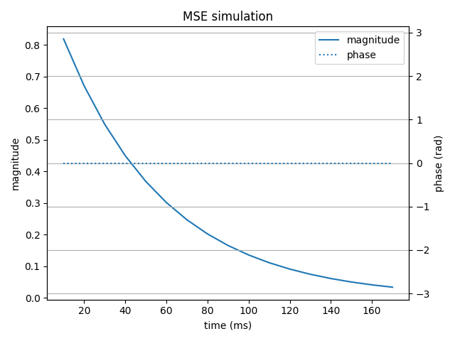
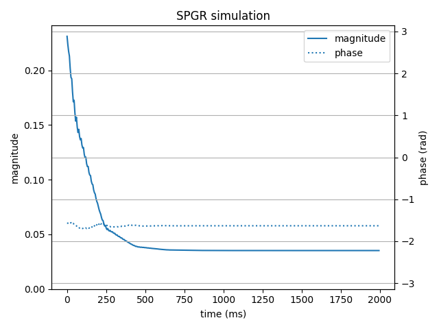
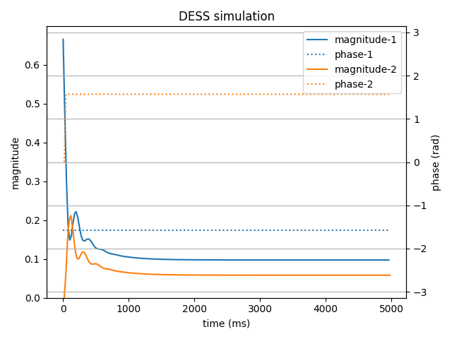

# `epgpy` basics

In this file, we will cover the basics of `epgpy`,
i.e. the main EPG operators, the `StatesMatrix` object and simulation helper functions.


## Introduction: how to build a sequence with `epgpy`

The `epgpy` library offers functions and objects for simulating nuclear magnetic resonance (NMR) phenomena according to the Extended Phase Graph (EPG) formalism. 

Please refer to « Extended Phase Graphs: Dephasing, RF Pulses, and Echoes - Pure and Simple» by Matthias Weigel (JMRI 2015) for an excellent introduction to EPG.

In short, the magnetization is decomposed into different phase states, which are stored in a state matrix. A phase state is composed of the transverse F+ and F- components and the longitudinal Z component. NMR phenomena are modeled with operators acting on the state matrix.

There are three basic "canonical" operators: 

1. The evolution operator `E`, for simulating the relaxation and precession of the magnetization. 
2. The transition operator `T`, for simulating RF pulses and whose effect is to mix F and Z components.
3. The shift operator `S`, for simulating gradients and whose effect is to create and move F components to different states.

EPG sequences are built by chaining various combinations of these operators, 
and the signal is simulated by applying the operators sequentially, starting from an initial state matrix.

Beyond these three operators, in `egppy` you will also find:
- advanced operators, such as the diffusion operator `D`, for simulating the effect of diffusion, the echange operator `X`, for simulating the echange phenomena between compartments (e.g. in magnetization transfer), and others;
- utility operators, such as the `ADC` operator, which has no effect on the state matrix and is only needed to tell the program to store the magnetization.

A complete list of the operators provided in `epgpy` is available [here](operators.md).

In practice, once the operators are instanciated, they are concatenated in a python list which is passed to the `simulate` function.

```python
# build sequence by chaining operators in a list
seq = [rf, relax, gradient] * num_echo

# simulate the resulting magnetization (F0, by default)
signal = simulate(seq)
```


## Main objects

Most objects can be imported directly from the root package:

```python
import epgpy as epg
```

### Basic operators

In the following it is shown how to instanciate the EPG operators and their main arguments.

```python
#
# transition operator (ideal rf-pulse)
# arguments: flip-angle (degree), RF phase (degree)
inversion = epg.T(180, 0)

#
# evolution operator (relaxation, precession)
# arguments: duration (ms), T1 (ms), T2 (ms), precession (kHz)
relax = epg.E(5, 1645, 50, g=0)

#
# shift operator (gradients)
# arguments: phase state increment (integer)
shift = epg.S(1)

#
# common arguments for all operators:

# set display name (e.g. for use in interactive session)
excit = epg.T(90, 90, name="excit")

# set virtual duration (ms)
# (this has no effect on the simulation, but is useful for plotting graphs)
shift = epg.S(1, duration=5)

# utilities
adc = epg.ADC  # enable recording phase state
probe = epg.Probe("Z0") # custom recording function
spoiler = epg.SPOILER # perfect gradient spoiler
wait = epg.Wait(1.0) # do nothing for some time (ms)
```


### Sequence definition and functions

Sequences are normally defined as (nested) python lists, and passed to the simulation functions:

```python
# define a sequence
spinecho = [excit, shift, relax, inversion, shift, relax, adc]

# simulate signal
signal = epg.simulate(spinecho)

# get ADC timing, **based on the `duration` attribute**
echo_time = epg.get_adc_times(spinecho)
```


### Examples

In the following examples, we simulate typical sequence with the above operators and plot the signals' magnitude and phase.

The plotting code is given in `examples/basics/tutorial.py`.

```python
# multi-spin echo (17 TE)
# note: make sure to reuse operators for efficiency
# (cf. also README.md for refocussing with FA < 180°)
necho = 17
mse = [excit] + [shift, relax, inversion, shift, relax, adc] * necho
mse_times, mse_signal = epg.simulate(mse, adc_time=True)
```



```python
# spoiled gradient echo
# note: nested lists can be used for more compact definitions
# note: the operateur "epg.Adc" accepts a `phase` argument to compensate for the RF pulse phase
necho = 400
phases = 58.5 * np.arange(necho) ** 2
spgr = [[epg.T(14.8, phase), relax, epg.Adc(phase=-phase), relax, shift] for phase in phases]
```



```python
# Double echo in steady state (DESS)
necho = 200
TR, TE = 19.9, 4.2
rf = epg.T(45, 0)
relax1 = epg.E(TE, 800, 70, duration=True)
relax2 = epg.E(TR - 2 * TE, 800, 70, duration=True)
dess = [rf, relax1, adc, shift, relax2, adc, relax1] * necho
dess_times, dess_signal = epg.simulate(dess, adc_time=True)
```




### State matrix 

In the following we describe the state matrix and its attributes. 

There is normally no need to access the state matrix object, but it can help understanding the coding choices and concepts.

```python
# create state matrix object
sm = epg.StateMatrix()

# attributes/properties
sm.states # (ndarray) state matrix
sm.equilibrium # (ndarray) equilibrium state matrix
sm.nstate # number of EPG phase states (only 0 and positive states)
sm.shape # shape of the jointly simulated states
sm.ndim # number of dimensions of the phase states

# magnetization
sm.F0 # (ndarray) F_0 state
sm.Z0 # (ndarray) Z_0 state
sm.F # (ndarray) all F states
sm.Z # (ndarray) all Z states

# phase state coordinates
# Note: only used with non trivial phase state shifts (e.g. 3d gradients, T2*)
sm.k  # (ndarray) wavenumber (rad/m, phase state coordinates, used in 3d gradient simulation)
sm.t  # (ndarray) accumulated time (ms, temporal phase coordinate, used in T2* simulation)

# initialization options
epg.StateMatrix([1, 1, 0])  # initial state != equilibrium
epg.StateMatrix(equilibrium=[0, 0, 10])  # different equilibrium
```

Operators can be directly applied on the state matrix, producing a new state matrix:

```python
# initial states
sm0 = epg.StateMatrix()

# rf pulse:
sm1 = excit(sm0)  # mix transverse and longitudinal states

# shift
sm2 = shift(sm1)  # shift transverse states (create new states if needed)

# relaxation
sm3 = relax(sm2)  # apply signal decay and precession
```

Which yields:
```
In : sm0.states
Out: array([[[0.+0.j, 0.+0.j, 1.+0.j]]])

In : sm1.states.real
Out: array([[[1.000000e+00, 1.000000e+00, 6.123234e-17]]])

In : sm2.states.real
Out:
array([[[0.000000e+00, 1.000000e+00, 0.000000e+00],
        [0.000000e+00, 0.000000e+00, 6.123234e-17],
        [1.000000e+00, 0.000000e+00, 0.000000e+00]]])

In : sm3.states.real
Out:
array([[[0.        , 0.90483742, 0.        ],
        [0.        , 0.        , 0.0030349 ],
        [0.90483742, 0.        , 0.        ]]])

```


### Vectorization

Most operators act on the state matrix with simple array operations or linear algebra. Since `epgpy` is based on `numpy`, we can use vectorization to efficiently compute many signals at once.

For instance, with the MSE sequence, we can simulate multiple T2 and B1 attenuation in a single call:

```python 
import time
import numpy as np
import epgpy as epg

num_t2 = 100 # number of T2 values
num_b1 = 50 # number of B1 attenuation values

# parameters
necho = 18
TE = 9.5
T1 = 1400
T2 = np.linspace(20, 60, num_t2)
att = np.linspace(0.2, 1, num_b1)

# build sequence
exc = epg.T(90, 90)
shift = epg.S(1)
rfc = epg.T(180 * att, 0)  # B1 on 1st axis
rlx = epg.E(TE / 2, T1, [T2])  # put T2 on 2d axis
adc = epg.ADC
seq = [exc] + [shift, rlx, rfc, shift, rlx, adc] * necho

# simulate
shape = epg.getshape(seq) # get signal's shape
print(f"Simulate {np.prod(shape)} signals")

time0 = time.time()
signal = epg.simulate(seq)
duration = time.time() - time0

print(f"Duration: {duration:.2f}s")
print(f"Output shape: {signal.shape}")
```

Output on a 1.80 GHz laptop with 32Go RAM:

```
Simulate 5000 signals
Duration: 0.69s
Output shape: (18, 50, 100)
```

