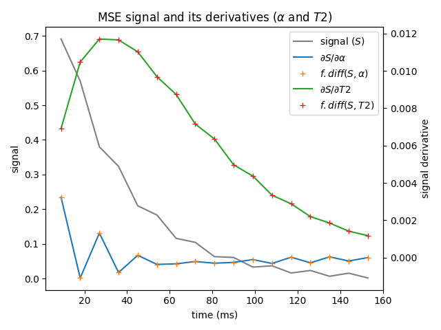
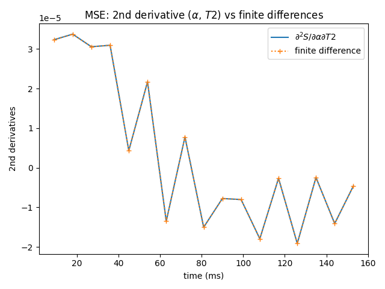
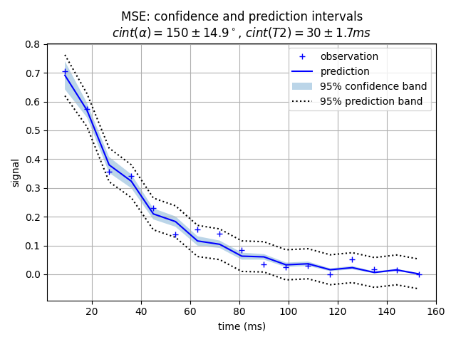

# Differentiation in `epgpy`

In `epgpy`, not only the signal can be simulated but also the first or second signal's derivatives 
with respect to some input parameters.

The signal's derivative is needed in various situations: sequence optimization, confidence interval calculation, etc.

To activate differentiation, simply fill the `order1` and `order2` keywords in the relevant operators.
Keyword `order1` is passed the list of parameters (string values) with respect to which to compute the 1st order derivatives. The parameters available for differentiation can be obtained from the attributes `PARAMETERS_ORDER1`. 

For the main operators:

- operator `T` has two parameters available for 1st order differentiation: `alpha` (flip angle) and `phi` (phase).
- operator `E` has four parameters available: `tau` (evolution time), `T1`, `T2` and `g` (precession rate).
- operator `S` has no parameter available for differentiation.

Similarly, keyword `order2` is passed the pairs of parameters for which to compute the 2nd order or cross derivatives. Attribute `PARAMETERS_ORDER2` gives the list of available parameter pairs.


## 1st order derivatives

Let's see how this works with an example: 
we will compute the derivative of the multi spin-echo (MSE) signal with respect to the flip angle (alpha) and T2.

```python
# sequence definition
necho = 17
excit = epg.T(90, 90)
# activate 1st order differentiation for `alpha`
invert = epg.T(150, 0, order1="alpha") 
# activate 1st order differentiation for `T2`
relax = epg.E(4.5, 1400, 30, order1="T2") 
shift = epg.S(1, duration=4.5)
adc = epg.ADC

# build sequence as a list
seq = [excit] + [shift, relax, invert, shift, relax, adc] * necho
```

Internally, the signal's derivatives are stored within the `order1`
attribute of the state matrix object and `sm.order1` is a dict of state matrix derivatives
indexed by the activated parameters.

An easy way to recover the Jacobian matrix
(the matrix of stacked signal's derivatives),
is to use the `Jacobian` probe operator.

```python
# signal jacobian
jprobe = epg.Jacobian(["alpha", 'T2'])

# retrieve the 17x2 Jacobian matrix
jac = epg.simulate(seq, probe=jprobe)
```

To check the derivatives, one can compute the finite difference
approximation and compare.

```python
# compare with finite differences
eps = 1e-8
invert_alpha = epg.T(150 + eps, 0)
seq_alpha = [excit] + [shift, relax, invert_alpha, shift, relax, adc] * necho
fdiff_alpha = (epg.simulate(seq_alpha) - signal) / eps

relax_T2 = epg.E(4.5, 1400, 30 + eps)
seq_T2 = [excit] + [shift, relax_T2, invert, shift, relax_T2, adc] * necho
fdiff_T2 = (epg.simulate(seq_T2) - signal) / eps
```

Which gives:



(the plotting code is given in `examples/differentiation/tutorial.py`)


## 2nd order derivatives

2nd order derivatives are activated by the `order2` keyword in the operator's definition,
and stored in the `order2` dictionary attribute of the state matrix, indexed by the relevant pair of parameters.

To recover the Hessian matrix (the matrix of 2nd order derivatives),
we use the `Hessian` probe operator.

Note: passing single parameters (not pairs) to the `order2` keyword automatically activates 1st and 2nd order differentiation with respect to these parameters AND activated parameters of OTHER operators. Passing pairs of parameters deactivates this automatic "cross-operator" calculation, which means you need to specify all pairs of parameters you want to be considered.

```python
# Activate 2nd (and 1st) order derivatives for `alpha` 
# This will automatically activate ('alpha', 'alpha') and ('alpha', 'T2') 2nd order derivatives
invert = epg.T(150, 0, order2="alpha") 
# activate 2nd (and 1st) order derivatives for `T2`
# This will automatically activate ('T2', 'T2') and ('alpha', 'T2') 2nd order derivatives
relax = epg.E(4.5, 1400, 30, order2="T2")

# build sequence
seq = [excit] + [shift, relax, invert, shift, relax, adc] * necho

# retrieve the Hessian 17x2x2 tensor using the Hessian probe operator
hprobe = epg.Hessian(['alpha', 'T2'])
hessian = epg.simulate(seq, probe=hprobe)
```

Compare to finite difference approximate derivatives:




## Confidence intervals

The signal's Jacobian matrix can be used for confidence interval calculation with the delta method.

Note: for simplification, observation noise is wrongly assumed to be Gaussian instead of Rician.


```python
from scipy import stats

# add noise to signal (s.t. sse == 0.01)
noise = np.random.normal(size=necho)
noise *= np.sqrt(1e-2 / np.sum(noise**2))

obs = np.maximum(signal.real[:, 0] + noise, 0)
pred = signal.real[:, 0]

# sum of squared error 
sse = np.sum((pred - obs) ** 2)

# Jacobian and hessian
J = jac[..., 0]
H = hessian[..., 0] # (also works without the Hessian)
nobs, nparam = J.shape

# number of degrees of freedom: num. echo - 2 (alpha and T2)
dof = nobs - nparam

# variance-covariance matrix
# V = np.linalg.inv((J.T @ J).real) # 1st order
V = np.linalg.inv((J.T @ J + H.T @ (pred - obs)).real) # 2nd order
V *= sse / dof
 
# c.int of reduced t statistics (mean=0, variance=1)
tval = np.asarray(stats.t.interval(0.95, dof))[1]

# confidence interval of alpha=150° and T2=30ms given above residuals
cint_alpha = np.sqrt(V[0, 0]) * tval
cint_T2 = np.sqrt(V[1, 1]) * tval

# confidence band
predvar = np.einsum('np,pq,nq->n', J, V, J).real
cband = np.sqrt(predvar) * tval

# prediction band
pband = np.sqrt(sse / dof + predvar) * tval

print(rf"c.int alpha: 150 +/- {cint_alpha}")
print(rf"c.int T2: 30 +/- {cint_T2}")
```




## How it works

Differentiable operators use explicit expressions to compute the partial derivative of the output state matrix with respect to a variable of interest. 
For instance, the transition operator `T` has expressions for derivatives with respect to flip angle `alpha` and RF phase `phi`, 
and evolution operator `E` has expressions for derivatives with respect to evolution time `tau`, `T1` and `T2` relaxation and off-resonance frequency `g`.

Let's define state matrix $M$, i-th phase state $M_i$, and equilibrium phase state $M_{eq}$:

```math
M = \{M_{eq}, M_0, \dots, M_N\},
\ 
M_i = \begin{bmatrix}
m_{i+} \\
m_{i-} \\
m_{iZ} 
\end{bmatrix},
\ 
M_{eq} = \begin{bmatrix} 
0 \\
0 \\
m_{Zeq}
\end{bmatrix}
```

EPG operators act on the state matrix to produce a new state matrix:

```math
 \mathcal{O}(M) = \{M_{eq}, [\mathcal{O}(M)]_0, \dots, [\mathcal{O}(M)]_N\}
```
The partial derivative of $\mathcal{O}(M)$ with respect to parameter $p$ is a derived state matrix:

```math
\frac{\partial \mathcal{O}}{\partial p}(M) = 
\left\{ 0, \left[ \frac{\partial \mathcal{O}}{\partial p} (M) \right]_0, \dots, \left[ \frac{\partial \mathcal{O}}{\partial p} (M) \right]_N  \right\}
```

Note that the equilibrium state being unmodified by operator $\mathcal{O}$, its derivative is $0$.

For instance, evolution operator $\mathcal{E}$ applies relaxations $T_1$, $T_2$ and precession $\gamma$ on each state independantly, 
with $T_1$-recovery for state $i=0$:

```math
\left[ \mathcal{E}(M) \right] _i =
\begin{bmatrix}
e^{-\tau/T_2 + j2\pi\tau\gamma} & 0 & 0 \\
0 & e^{-\tau/T_2 - j2\pi\tau\gamma} & 0 \\
0 & 0 & e^{-\tau/T_1}
\end{bmatrix}
(M_i - \delta_i M_{eq}) + \delta_i M_{eq}
```


In this case, the derivative of $\mathcal{E}(M)$ with respect of $\tau$, $T_1$, $T_2$ or $\gamma$ is easily computed for each phase state independantly. 
For instance, with respect to $T_1$:

```math
\left[ \frac{\partial \mathcal{E}}{\partial T_1}(M)\right]_i = 
\begin{bmatrix}
0 & 0 & 0 \\
0 & 0 & 0 \\
0 & 0 & \frac{\tau}{T_1^2} e^{-\tau/T_1}
\end{bmatrix}
(M_i - \delta_i M_{eq})
```

A sequence $\mathcal{S}$ is a concatenation of operators, applied in succession:

```math
\mathcal{S}(M) = \mathcal{O}_n \mathcal{O}_{n-1} \dots \mathcal{O}_1(M)
```

Since all operators $\mathcal{O}_n$ are linear, 
the derivative of signal $\mathcal{S}$ with respect to parameter $p$ is computed using the chain rule for linear operators:

```math
\begin{aligned}
\frac{\partial\mathcal{S}}{\partial p}(M) &= 
\frac{\partial}{\partial p} \left(
\mathcal{O}_n \dots \mathcal{O}_1
\right)(M) \\
& = \sum^n_{k=1} \mathcal{O}_n\dots \frac{\partial \mathcal{O}_k}{\partial p} \dots \mathcal{O}_1(M)
\end{aligned}
```

In each term of the sum, operators at indices $>k$ are applied on derived state matrices, due to applying after the partially differentiated operator at index $k$.
Conversely, operators at indices $<k$ are applied on non-derived state matrices, sharing the same calculations as in $\mathcal{S}(M)$.
